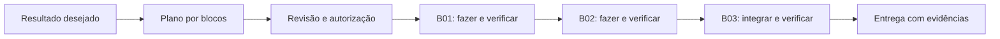

# Hubbi Modo Plan

**Planeje com a IA. Aprove a execução. Acompanhe por blocos. Confira a entrega.**

Este é o método de trabalho de Bruno Palhardi, adaptado para os alunos da Hubbi. Ele ajuda você a transformar uma ideia em uma entrega que consegue conferir, mantendo as decisões importantes nas suas mãos.

Imagine pedir uma lista de estudos: você quer cadastrar **3 tarefas**, concluir **1** e continuar vendo essa tarefa concluída depois de recarregar a página. Essa demonstração define o resultado. O agente propõe o caminho, divide o trabalho e mostra as evidências ao terminar.

Os números desse exemplo são fictícios. O repositório contém material didático, modelos e um exercício para aplicar o método.

## Comece em 5 passos

1. **Descreva o resultado:** quem vai usar, o problema, o que precisa funcionar e como você pretende conferir.
2. **Peça um plano:** o agente faz uma inspeção curta e propõe todos os blocos antes de implementar.
3. **Revise e autorize:** ajuste o escopo e diga explicitamente que pode executar o plano inteiro.
4. **Acompanhe os checkpoints:** a cada bloco, o agente informa resultado, evidência e próximo passo; continua dentro do que foi aprovado.
5. **Confira a entrega:** veja o fluxo funcionando e separe o que está localmente pronto do que foi publicado e verificado.



Se surgir uma decisão indispensável, um risco relevante ou uma ampliação do escopo, o agente volta a você com uma recomendação. A execução automática vale dentro do plano autorizado.

## Copie seu primeiro pedido

```text
Quero [resultado] para [público], porque hoje [problema e consequência].

Antes de implementar, faça uma inspeção curta e monte um plano por blocos
com início, meio e fim. Defina escopo, dependências, resultado de cada bloco,
critérios de aceite e verificações. Recomende modelo e esforço de raciocínio
disponíveis e explique se vale executar sozinho ou com subagentes.

Quero conferir a entrega assim: [demonstração concreta].
Não inclua [exclusões]. Aguarde minha autorização para executar.
```

Depois de revisar o plano:

```text
Aprovo e autorizo a execução completa do plano [nome, caminho e versão],
de B01 até [último bloco]. Informe checkpoints e avance automaticamente
entre os blocos aprovados. Verifique a entrega integrada e feche com evidências.
Publicação e operações externas autorizadas: [liste ou escreva “nenhuma”].
```

## Percurso de leitura

| Material | Para que serve |
|---|---|
| [Guia do método](docs/metodo.md) | Entender planejamento, aprovação, blocos, verificações e entrega |
| [Prompts prontos](docs/prompts.md) | Pedir plano, executar, acompanhar, resolver impedimento e retomar |
| [Configuração e modelos](docs/configuracao.md) | Escolher capacidade, raciocínio e delegação; aplicar instruções no projeto |
| [Modelo de plano](modelos/plano.md) | Preencher um plano completo com critérios de aceite |
| [Instruções para seu agente](modelos/AGENTS.md) | Levar o método para outro projeto |
| [Modelo de checkpoint](modelos/checkpoint.md) | Acompanhar a passagem entre blocos |
| [Modelo de fechamento](modelos/fechamento.md) | Conferir resultado, publicação e pendências |
| [Exemplo completo e exercício](exemplos/lista-de-estudos.md) | Ver o método preenchido, da ideia ao fechamento simulado |

Comece pelo guia e pelo exemplo. Quando for aplicar, copie os modelos e use os prompts.

## O que significa “Modo Plan” aqui

É o nome do método Hubbi de trabalhar: **planejar antes de implementar uma demanda com várias etapas, autorizar o conjunto e executar por blocos até conferir o resultado**.

Você pode pedir esse fluxo em linguagem natural. Recursos como `/plan` e `/goal` dependem do produto e da versão usados. Consulte [como aplicar no seu ambiente](docs/configuracao.md); o comando é uma ferramenta para apoiar o método.

## Origem e manutenção

Método de Bruno Palhardi, disponibilizado pela Hubbi. A regra central foi definida em setembro de 2026; esta adaptação didática foi publicada em outubro de 2026.

As regras de escopo, aprovação única, checkpoints e entrega são escolhas do método Hubbi. As explicações sobre recursos do Codex apontam para a documentação oficial. Nomes de modelos e disponibilidade devem ser conferidos no seu ambiente antes de cada plano.

Para manter este material, consulte as [instruções do repositório](AGENTS.md). Elas são diferentes do [modelo para copiar para seu projeto](modelos/AGENTS.md).
